## git使用指南

###  git介绍

> C语言编写的一个分布式版本控制系统

1. git工作原理


```

Workspace：工作区
Index / Stage：暂存区
Repository：仓库区（或本地仓库）
Remote：远程仓库

```

2.git和svn区别

+ svn集中式


+ git分布式


> 为什么说git是分布式的
```
  这里的“分布式”是相对于“集中式”来说的。把数据集中保存在服务器节点，所有的客户节点都从服务节点获取数据的版本控制系统叫做集中式版本控制系统，比如svn就是典型的集中式版本控制系统。

  与之相对，git的数据不止保存在服务器上，同时也完整的保存在本地计算机上，所以我们称git为分布式版本控制系统。

  git的这种特性带来许多便利，比如你可以在完全离线的情况下使用git，随时随地提交项目更新，而且你不必为单点故障过分担心，即使服务器宕机或数据损毁，也可以用任何一个节点上的数据恢复项目，因为每一个开发节点都保存着完整的项目文件镜像。

```
> git和svn差异对比

|差异点|svn|git|
|:-|:--|:-|
|系统特点|1.集中式版本控制系统（文档管理很方便) <br /> 2.企业内部并行集中开发 <br />3.windows系统上开发推荐使用<br />4.克隆一个拥有将近一万个提交(commit),五个分支,每个分支有大约1500个文件，用时将近一个小时|1.分布式系统（代码管理很方便）<br />2.开源项目开发<br />3.mac,Linux系统上开发推荐使用<br />4.克隆一个拥有将近一万个提交(commit),五个分支,每个分支有大约1500个文件，用时1分钟|
|灵活性|1.搭载svn的服务器出现故障，无法与之交互<br />2.所有的svn操作都需要中央仓库交互（例：拉分支，看日志等）|1.可以单机操作，git服务器故障也可以在本地git仓库工作<br />2.除了push和pull（或fetch）操作，其他都可以在本地操作<br />3.根据自己开发任务任意在本地创建分支4.日志都是在本地查看，效率较高|
| 安全性 | 较差，定期备份，并且是整个svn都得备份 | 较高，每个开发者的本地就是一套完整版本库，记录着版本库的所有信息（gitlab集成了备份功能） |
| 分支方面 | 1.拉分支更像是copy一个路径<br/>2.可针对任何子目录进行branch<br/>3.拉分支的时间较慢，因为拉分支相当于copy<br/>4.创建完分支后，影响全部成员，每个人都会拥有这个分支<br/>5.多分支并行开发较重（工作较多而且繁琐） | 1.我可以在Git的任意一个提交点（commit point）开启分支！（git checkout -b newbranch HashId）<br/>2.拉分支时间较快，因为拉分支只是创建文件的指针和HEAD<br/>3.自己本地创建的分支不会影响其他人<br/>4.比较适合多分支并行开发<br/>5.git checkout hash值(切回之前的版本，无需版本回退) |
| 版本控制 | 1.保存前后变化的差异数据，作为版本控制<br/>2.版本号进行控制，每次操作都会产生一个高版本号（svn的全局版本号，这是svn一个较大的特点，git是hash值） | 1.git只关心文件数据的整体发生变化，更像是把文件做快照，文件没有改变时，分支只想这个文件的指针不会改变，文件发生改变，指针指向新版本<br/>\2. 40 位长的哈希值作为版本号，没有先后之分 |
| 工作流程 | 1.每次更改文件之前都得update操作，有的时候修改过程中这个文件有更新，commit不会成功<br/>2.有冲突，会打断提交动作（冲突解决是一个提交速度的竞赛：手快者，先提交，平安无事；手慢者，后提交，可能遇到麻烦的冲突解决。） | 1.开始工作前进行fetch操作，完成开发工作后push操作，有冲突解决冲突<br/>2.git的提交过程不会被打断，有冲突会标记冲突文件 |
| 学习成本 | 使用起来更方便，svn对中文支持好，操作简单，适用于大众 | 更在乎效率而不是易用性，成本较高（有很多独有的命令，rebase，远程仓库交互的命令，等等） |
| 权限管理 | svn的权限管理相当严格，可以按组、个人针对某个子目录的权限控制（每个目录下都会有个.svn的隐藏文件） | git没有严格的权限管理控制，只有账号角色划分 |

### git常用命令


1. 初始化一个git仓库：git init
2. 克隆仓库：git clone <url>
3. 添加文件（提交到缓存区）：git add <file>
4. 提交文件（提交到HEAD）：git commit -m <message>
5. 推送改动(提交到远程仓库)：git push orgin <branch_name>
6. 查看git仓库状态：git status
7. 查看修改内容：git diff
8. 查看提交日志：git log
9. 回复版本：git reset --hard <commit_id>
10. 创建分支：git branch <branch_name>
11. 切换分支: git check <branch_name> /git switch <branch_name>
12. 查看分支：git branch
13. 合并分支：git merge <branch_name>
14. 删除分支：git branch -d <branch_name>
15. 查看远程库信息：git remore -v
16. 显示标签：git tag
17. 新建标签：git tag <tag_name> 
18. 新建带备注的标签：git tag -a <tag_name> -m <tag_message>
19. 给某个commit答标签：git tag -a <tag_name> <commit_id> -m <tag_message>

### tag和branche的区别
+ tag 对应某次 commit, 是一个点，是不可移动的（类似里程碑）

+ branch 对应一系列 commit，是很多点连成的一根线，有一个HEAD 指针，是可以依靠 HEAD 指针移动的

  

> git有commit，为什么还要引入tag？
```

"请把上周一的那个版本打包发布，commit号是6a5819e…"

"一串乱七八糟的数字不好找！"

如果换一个办法：

"请把上周一的那个版本打包发布，版本号是v1.2"

"好的，按照tag v1.2查找commit就行！"

所以，tag就是一个让人容易记住的有意义的名字，它跟某个commit绑在一起。


```

### 工作流程

```
1.对代码进行修改
2.完成了某项功能，提交（commit，只是提交到本地代码库），1-2可以反复进行，直到觉得可以推送到服务器上时，执行3
3.拉取（pull，或者用获取 fetch 然后再手动合并 merge）
4.如果存在冲突，解决冲突
5.推送（push），将数据提交到服务器上的代码库

```

### Eclipse使用git

> 右键->team

+ commit

  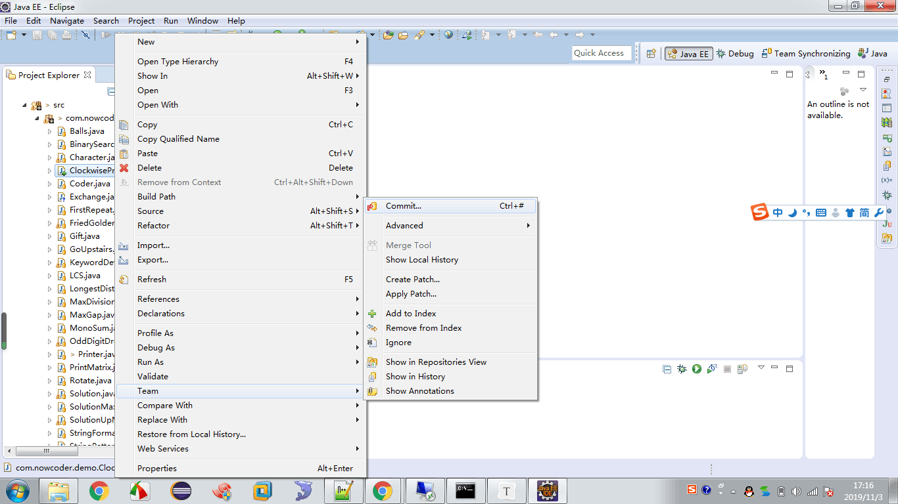

  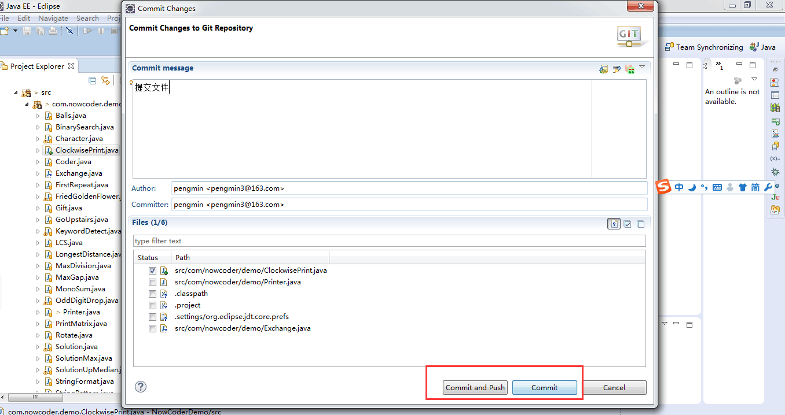

+ push

  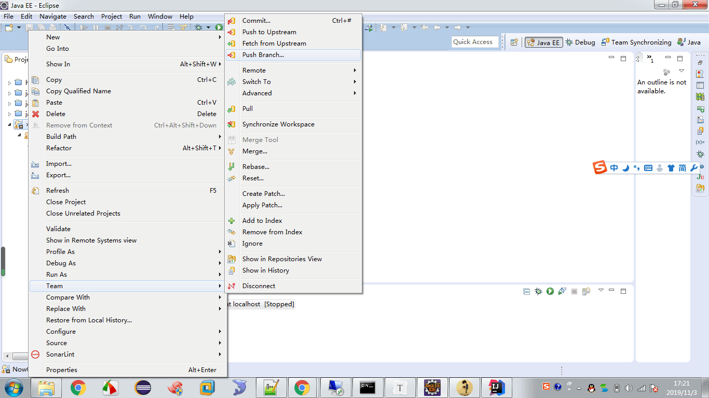

+ pull

  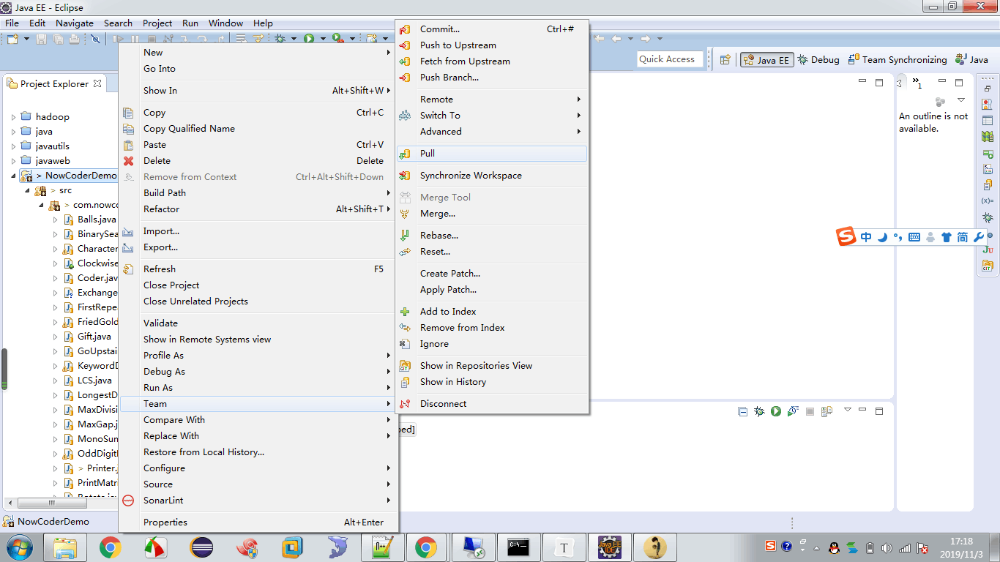

+ 分支

  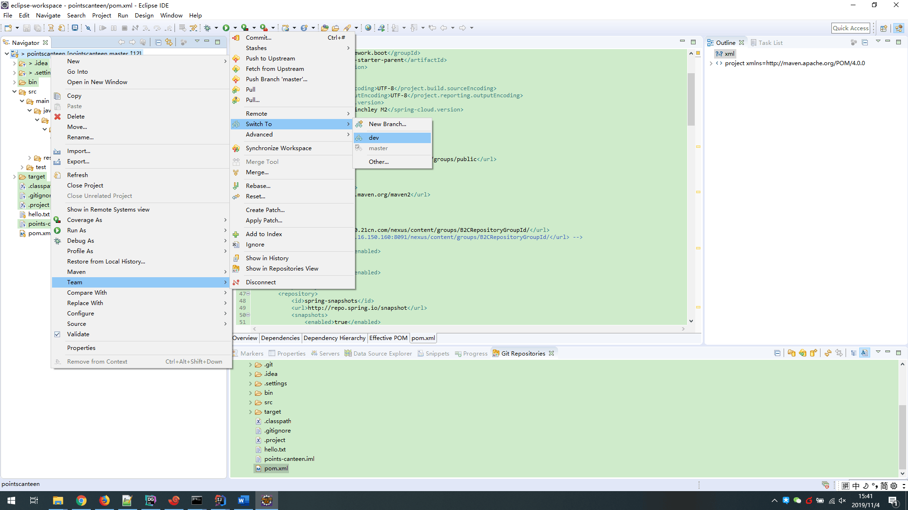

+ 合并

  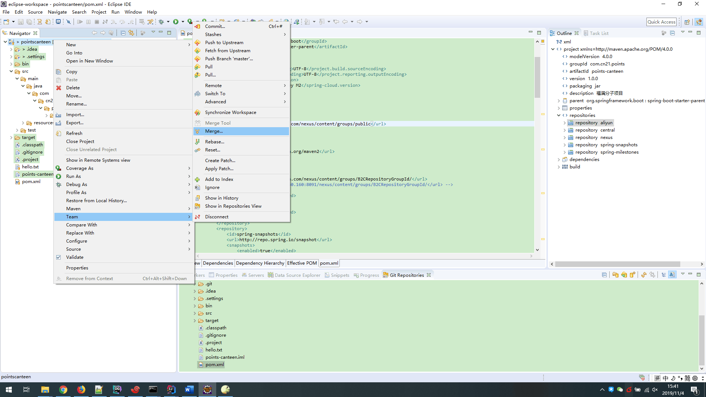

### idea使用git

+ commit

  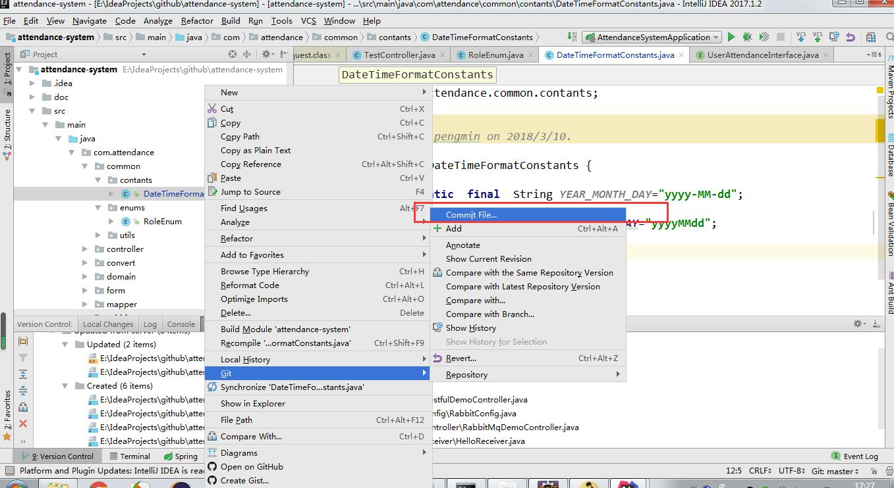

  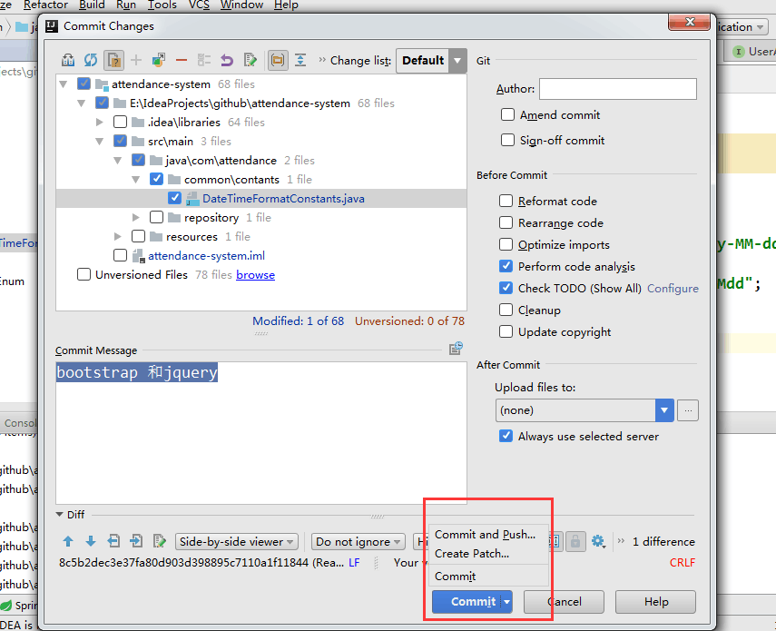

+ push/pull

  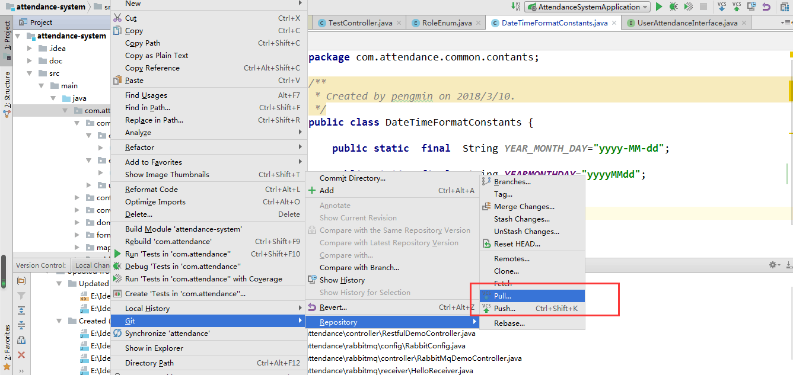

  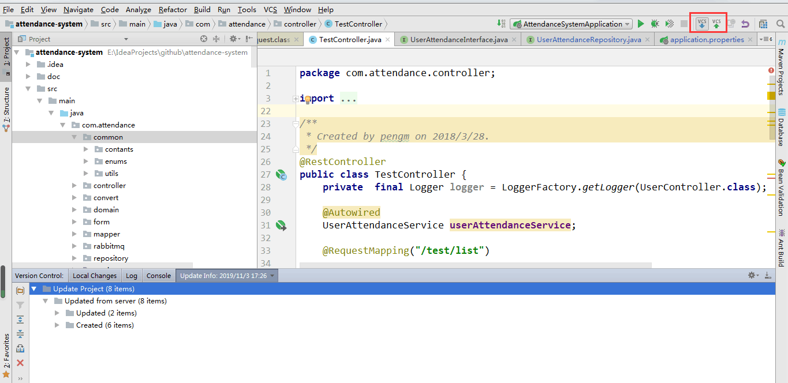

+ 分支

  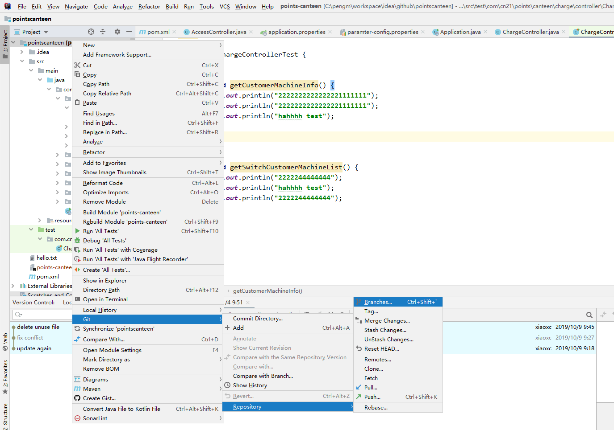

  

+ 合并分支

  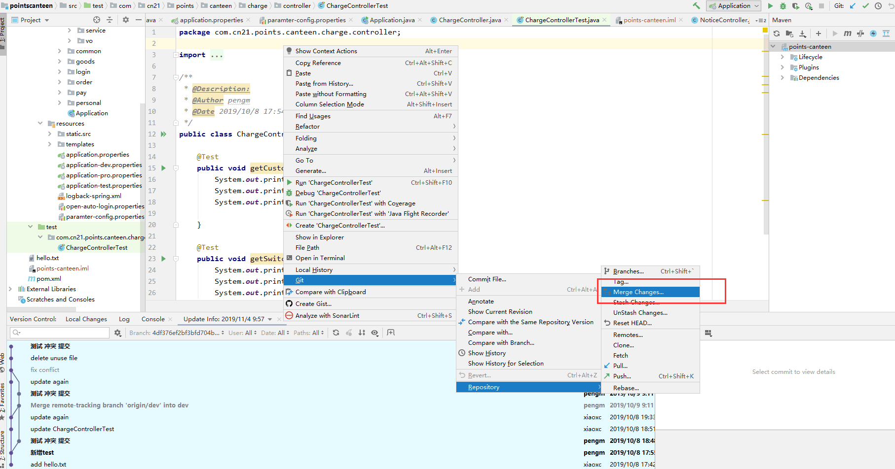

+ 解决冲突

  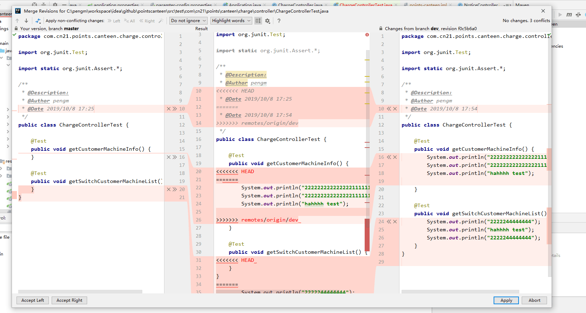

### gitlab项目管理

1. 创建项目组

   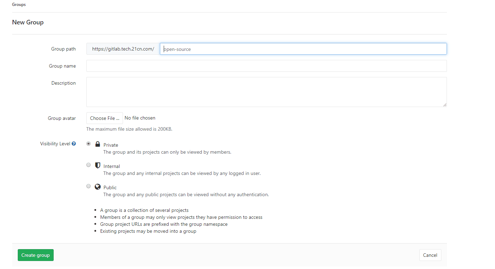

   ```
   私有库：只有被赋予权限的用户可见
   内部库：登录用户可以下载
   公开库：所有人可以下载
   ```

2.  添加项目组成员

   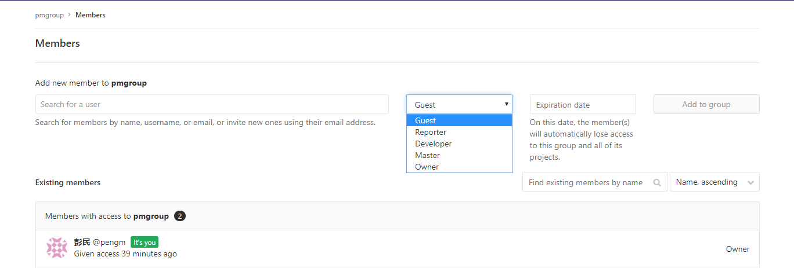

3. 创建项目

   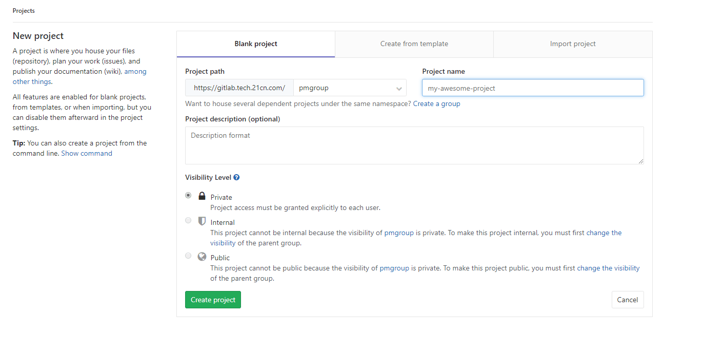

4. 添加项目成员

   


5. **设置人员**

> 人员权限
```
Guest(游客):可以创建issue、发表评论，不能读写版本库
Reporter(记者):可以克隆代码，不能提交
Developer(开发者):可以克隆代码、开发、提交、push
Master(主要维护者):可以创建项目、添加tag、保护分支、添加项目成员、编辑项目
Owner(所属者):可以设置项目访问权限 - Visibility Level、删除项目、迁移项目、管理组成员

```
> 具体可看 https://docs.gitlab.com/ee/user/permissions.html
### 参考文档

> https://www.liaoxuefeng.com/wiki/896043488029600
>
> https://juejin.im/entry/5b1faf61f265da6e5b7635b6
>
> https://www.bootcss.com/p/git-guide/

